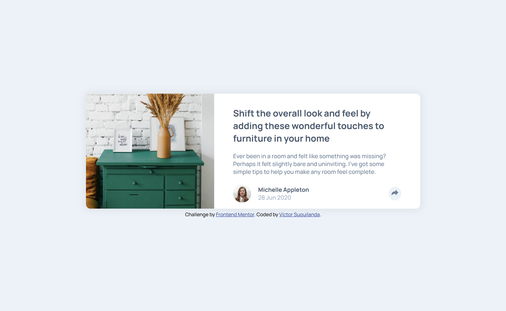

# Frontend Mentor - Article preview component solution

This is a solution to the [Article preview component challenge on Frontend Mentor](https://www.frontendmentor.io/challenges/article-preview-component-dYBN_pYFT). Frontend Mentor challenges help you improve your coding skills by building realistic projects. 

## Table of contents

- [Overview](#overview)
  - [The challenge](#the-challenge)
  - [Screenshot](#screenshot)
  - [Links](#links)
- [My process](#my-process)
  - [Built with](#built-with)
  - [What I learned](#what-i-learned)
  - [Continued development](#continued-development)
  - [Useful resources](#useful-resources)
  - [AI Collaboration](#ai-collaboration)
- [Author](#author)

## Overview

### The challenge

Users should be able to:

- View the optimal layout for the component depending on their device's screen size
- See the social media share links when they click the share icon

### Screenshot



### Links

- Solution URL: [Add solution URL here](https://your-solution-url.com)
- Live Site URL: [Add live site URL here](https://your-live-site-url.com)

## My process

### Built with

- Semantic HTML5 markup
- CSS custom properties
- BEM Naming Convention
- Flexbox
- Mobile-first workflow
- JavaScript

### What I learned

One of the main things I learned during this project was how to use **CSS anchor positioning** to position an element relative to another element. I used an anchor to position the social media sharing options relative to the share button, which allowed me to reproduce the intended layout without relying entirely on traditional positioning techniques.

```css
.article-component__share-opts {
  position-anchor: --share-btn;
  bottom: anchor(top);
  left: anchor(center);
  transform: translateX(-50%);
}
```

Another important learning was **JavaScript and DOM manipulation**. This was my first Frontend Mentor challenge involving JavaScript, so completing the entire script was an important milestone for me. Although the script is relatively small, it helped me practice fundamental concepts such as event handling, variable declaration and initialization, DOM selection, and the use of properties and methods to modify elements dynamically.

For example, I used a `click` event listener to change the share button state, show or hide the sharing options, and update the button icon:

```js
shareButton.addEventListener("click", function () {
  const shareOptsSection = footrCtntWrpr.querySelector("#article-share-opts");

  shareOptsSection.toggleAttribute("hidden");
  shareOptsSection.classList.toggle("article-component__share-opts");
});
```

Working through this interaction also helped me understand how JavaScript can control the **state of an interface**, while CSS remains responsible for defining how that state is visually represented.

### Continued development

One area I would like to continue improving is the use of **good implementation practices when combining HTML, CSS, and JavaScript**. I found it challenging to achieve the desired interactive behavior without mixing responsibilities between JavaScript and CSS, and this sometimes made my implementation more complicated than necessary.

I also noticed that my CSS grew to around **200 lines** for a relatively small project. While it works as intended, I feel that the resulting structure could be difficult to maintain or extend.

In future projects, I would like to explore and apply different approaches and methodologies that help me establish clearer responsibilities between HTML, CSS, and JavaScript, while also keeping my CSS more organized, maintainable, and appropriate for the size of the project.

### Useful resources

- [**CSS Dialog Boxes: A Comprehensive Guide and Examples for All Arrow Directions**](https://uipencil.com/2023/02/20/creating-css-bubble-dialog-boxes-with-arrow-styling-a-complete-guide-with-examples-for-all-arrow-directions/) - An article written on [**UIPENCIL**](https://uipencil.com/) that demonstrates how to implement box layouts with arrow directions. It was used to define the box layout for the sharing options on desktop devices.
- [**CSS Anchor Position**](https://lenguajecss.com/css/posicionamiento/anchor-position/) - An article from manz.dev that explains how to define and use anchor positioning, illustrating the necessary properties with practical examples. It was used to define the layout of the share options for both mobile and desktop versions.
- [**DOM**](https://lenguajejs.com/dom/) - An entire section on manz.dev dedicated to the DOM. It explains how to manage the objects that make up the DOM using JavaScript. The topics covered in this section were extremely helpful in understanding how certain objects, properties, and methods work and are used. 

### AI Collaboration

I used **ChatGPT** throughout the development of this project as a learning and problem-solving assistant.

One of the main ways it helped me was by reviewing my approach to combining **CSS and JavaScript responsibilities**. Through these discussions, I was able to better understand which parts of the interface should be handled by CSS and which should be controlled by JavaScript, as well as identify areas where I was making the implementation more complicated than necessary.

ChatGPT also helped me understand **CSS stacking contexts and the use of `z-index`**, which was particularly useful when working with the different layers of the share interaction.

Finally, I used ChatGPT to help me **review and refine the documentation for this project**, including the writing of this README.

## Author

- **Name** - Víctor Suquilanda
- **Frontend Mentor** - [@victor-sc12](https://www.frontendmentor.io/profile/victor-sc12)
- **GitHub** - [@victor-sc12](https://github.com/victor-sc12)